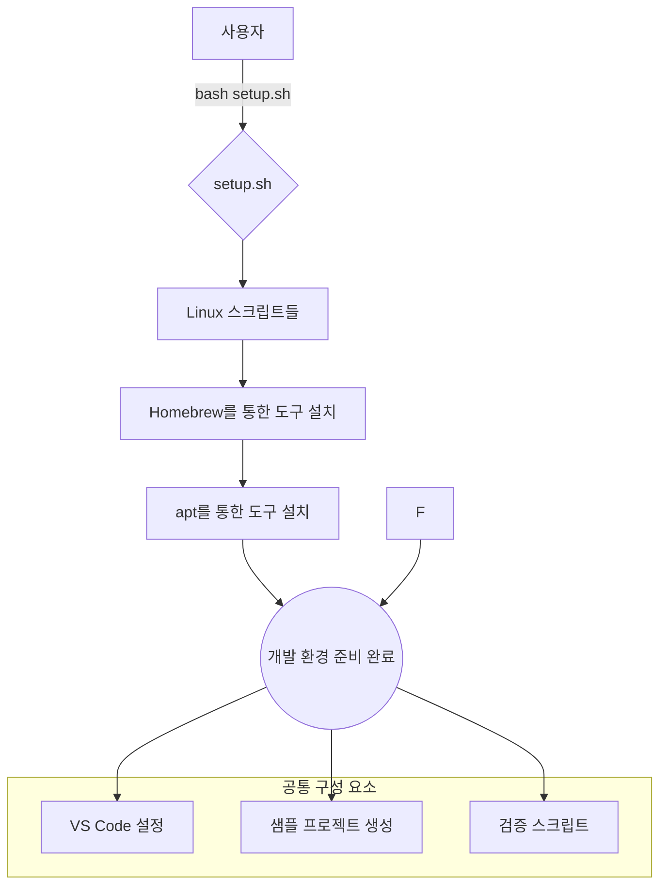

# C++ 개발 환경 자동 설정 도구

Linux에서 현대적인 C++ 개발 환경을 자동으로 설정하는 도구입니다.


---

## 📋 목차

1. [개요](#-개요)
2. [프로젝트 목표](#-프로젝트-목표)
3. [아키텍처](#-아키텍처)
4. [설치 및 설정](#-설치-및-설정)
5. [사용법](#-사용법)
6. [설치되는 도구들](#-설치되는-도구들)
7. [프로젝트 구조](#-프로젝트-구조)
8. [개발자 가이드](#-개발자-가이드)
9. [CI/CD](#-cicd)
10. [문제 해결](#-문제-해결)
11. [라이선스](#-라이선스)

---

## 🎯 개요

### 목적

C++ 개발자를 위한 완전하고 일관된 개발 환경을 빠르고 자동으로 설정하는 것

### 범위

컴파일러, 빌드 도구, 린터, 에디터 설정 등 C++ 개발에 필요한 모든 도구의 자동 설치 및 구성

### 대상 사용자

현대적이고 생산적인 C++ 작업 환경을 빠르게 구축하고자 하는 개발자

### 지원 플랫폼

- **Linux**: Ubuntu 22.04 이상

---

## 🚀 프로젝트 목표

### 🔍 해결하는 문제

C++ 개발 환경 설정은 종종 시간이 많이 걸리고 오류가 발생하기 쉬운 과정입니다. 개발자들은 컴파일러부터 디버거, 코드 포매터, 에디터 확장까지 광범위한 도구들을 수동으로 설치하고, 서로 다른 운영체제에서 이들이 원활하게 함께 작동하도록 구성해야 합니다.

### ✅ 성공 기준

- **자동화된 설정**: 단일 명령어(`bash setup.sh`)로 모든 필수 도구를 성공적으로 설치하고 구성
- **멱등성**: 스크립트를 여러 번 실행해도 기존 설정을 변경하거나 오류를 발생시키지 않음
- **검증**: `verify.sh` 스크립트를 통해 모든 컴포넌트가 올바르게 설치되고 PATH에 접근 가능한지 확인

### 🛠️ 접근 방법

모듈식 쉘 스크립트 컬렉션을 사용하여 설정 과정을 자동화합니다. 메인 `setup.sh` 스크립트가 공통 스크립트에 작업을 위임합니다. 이 접근법은 유지보수성을 보장하고 개별 도구의 설치 단계를 쉽게 추가하거나 수정할 수 있게 합니다.

---

## 🏗️ 아키텍처

### 고수준 다이어그램

사용자는 단일 진입점 스크립트를 실행하고, 이 스크립트는 감지된 운영체제에 따라 일련의 전문화된 스크립트들을 조정합니다.



### 주요 구성 요소

| 구성 요소 | 책임 | 기술 | 상태 |
|---|---|---|---|
| `setup.sh` | 메인 진입점, 다른 스크립트 조정 | Bash | 안정 |
| `verify.sh` | 모든 도구가 설치되어 PATH에서 접근 가능한지 확인 | Bash | 안정 |
| `linux/` 스크립트들 | `apt`를 사용한 Linux 도구 설치 처리 | Bash | 안정 |
| `common/` 스크립트들 | VS Code 구성 등 공통 로직 포함 | Bash | 안정 |
| `assets/` | 템플릿 및 구성 파일 저장 (VS Code 설정 등) | JSON | 안정 |

---

## 💻 설치 및 설정

### 사전 요구사항

> **Linux**
>
> - `sudo` 권한 필요
> - 안정적인 인터넷 연결

### 설치 과정

```bash
# 1) 저장소 복제
git clone https://github.com/movingChurch/readable-code-cpp-development-environment.git
cd readable-code-cpp-development-environment

# 2) 메인 설정 스크립트 실행
cd scripts/cpp_development_environment
bash setup.sh
```

스크립트는 자동으로 운영체제를 감지하고 필요한 도구들의 설치를 시작합니다.

---

## 📖 사용법

### 설치 검증

설정 스크립트가 완료된 후, 검증 스크립트를 실행하여 모든 구성 요소가 올바르게 설치되었는지 확인할 수 있습니다.

```bash
# scripts/cpp_development_environment 디렉토리에서
bash verify.sh
```

### 샘플 프로젝트

설치 과정에서 홈 디렉토리에 `~/cpp-sample` 경로에 "Hello, World" C++ 샘플 프로젝트가 자동으로 생성됩니다. 이 프로젝트는 이미 구성되고 빌드되어 있으며, 실행 파일을 실행하여 환경이 제대로 작동하는지 확인할 수 있습니다.

```bash
# 샘플 프로젝트로 이동
cd ~/cpp-sample

# 빌드된 실행 파일 실행
./build/hello_world

# 예상 출력: Hello, Modern C++! y = 84
```

### 스크립트 포매팅

프로젝트에는 모든 쉘 스크립트를 일관된 스타일로 포매팅하는 도구가 포함되어 있습니다.

```bash
# 모든 쉘 스크립트 포매팅
./scripts/format_shell_scripts.sh --format

# 포매팅 검사 (변경 없이 확인만)
./scripts/format_shell_scripts.sh --check

# shellcheck 실행
./scripts/format_shell_scripts.sh --shellcheck

# 모든 검사 실행 (포매팅 + 검증 + shellcheck)
./scripts/format_shell_scripts.sh --all
```

---

## 🛠️ 설치되는 도구들

### 컴파일러 및 빌드 도구

- **Clang/LLVM**: 현대적인 C++ 컴파일러 및 도구 체인
  - `clang`: C/C++ 컴파일러
  - `clangd`: LSP(Language Server Protocol) 서버 (자동완성, 오류 검사)
  - `clang-format`: 코드 포매팅 도구
  - `clang-tidy`: 정적 분석 도구
  - `lldb`: 디버거
- **CMake**: 크로스 플랫폼 빌드 시스템 생성기
- **Ninja**: 고속 빌드 도구

### 개발 도구

- **Git**: 분산 버전 관리 시스템
- **GitHub CLI**: GitHub와의 명령줄 인터페이스
- **Visual Studio Code**: 현대적인 IDE
  - clangd 확장 프로그램과 함께 최적화된 C++ 개발 설정
  - 자동 저장, 포매팅, 구문 강조 등 미리 구성됨

### 폰트

- **Fira Code**: 프로그래밍을 위한 리거처 지원 폰트

### VS Code 구성

설치된 VS Code는 다음과 같이 C++ 개발에 최적화되어 구성됩니다:

```json
{
  "editor.formatOnSave": true,
  "files.autoSave": "afterDelay",
  "editor.fontFamily": "'Fira Code', Menlo, Monaco, 'Courier New', monospace",
  "editor.fontLigatures": true,
  "C_Cpp.intelliSenseEngine": "disabled",
  "clangd.detectExtensionConflicts": false,
  "clangd.arguments": [
    "--background-index",
    "--clang-tidy",
    "--completion-style=detailed",
    "--header-insertion=iwyu"
  ]
}
```

---

## 📁 프로젝트 구조

```bash
readable-code-cpp-development-environment/
├── README.md                                    # 이 파일
├── LICENSE                                      # HolyGround 듀얼 라이선스
├── .github/workflows/ci.yml                     # CI/CD 파이프라인
├── .editorconfig                                # 에디터 구성
├── .gitignore                                   # Git 무시 파일
├── assets/
│   └── vscode_settings_template.json            # VS Code 설정 템플릿
└── scripts/
    ├── README.md                                # 스크립트 디렉토리 문서
    ├── format_shell_scripts.sh                 # 쉘 스크립트 포매터
    └── cpp_development_environment/
        ├── setup.sh                            # 메인 설정 스크립트
        ├── verify.sh                           # 설치 검증 스크립트
        ├── common/                             # 공통 스크립트
        │   ├── utilities.sh                    # 공통 유틸리티 함수
        │   ├── configure_vscode.sh             # VS Code 구성
        │   └── setup_sample_project.sh         # 샘플 프로젝트 생성
        └── linux/                              # Linux 전용 스크립트
            ├── install_clang.sh                # Clang/LLVM 설치
            ├── install_cmake.sh                # CMake 설치
            ├── install_ninja.sh                # Ninja 설치
            ├── install_git.sh                  # Git 설치
            ├── install_github_cli.sh           # GitHub CLI 설치
            ├── install_vscode.sh               # VS Code 설치
            └── install_coding_font.sh          # Fira Code 폰트 설치
```

---

## 👨‍💻 개발자 가이드

### 코드 품질 표준

프로젝트의 모든 쉘 스크립트는 다음 표준을 따릅니다:

#### 포매팅 규칙

- **들여쓰기**: 2칸 스페이스
- **케이스문 들여쓰기**: 활성화
- **이진 연산자**: 다음 줄에 위치 (`&&`, `||`)
- **함수 여는 브레이스**: 같은 줄에 위치
- **최대 줄 길이**: 120자
- **끝부분 공백**: 제거
- **파일 끝 개행**: 강제

#### 오류 처리

모든 스크립트는 표준화된 오류 처리를 사용합니다:

```bash
# 표준 오류 코드
ERROR_GENERAL=1
ERROR_DEPENDENCY_MISSING=2
ERROR_INSTALLATION_FAILED=3
ERROR_VERIFICATION_FAILED=4
ERROR_CONFIGURATION_FAILED=5
ERROR_PERMISSION_DENIED=6

# 통합 오류 처리 함수
handle_error <error_code> <error_message> [cleanup_function]

# 중요 명령어 자동 실행 및 오류 처리
handle_critical_command <command> <error_message> [cleanup_function]
```

#### 로깅 함수

일관된 로깅을 위해 표준화된 함수들을 사용합니다:

```bash
log_info "정보 메시지"
log_warning "경고 메시지"
log_error "오류 메시지"
```

### 기여 가이드

새로운 설치 스크립트를 추가할 때:

1. **표준화된 오류 처리 사용**
2. **적절한 로깅 함수 사용**
3. **shellcheck 통과 확인**
4. **포매팅 규칙 준수**

```bash
# 기여 전 확인 사항
./scripts/format_shell_scripts.sh --all
```

### 아키텍처 특징

#### 단일 책임 원칙

- **사전 검사**: `perform_preflight_checks()` 함수
- **설치 워크플로우**: `execute_installation_workflow()` 함수
- **개별 단계 실행**: `execute_installation_step()` 함수

#### 모듈성

각 도구의 설치는 독립적인 스크립트로 분리되어 있어 유지보수와 확장이 용이합니다.

---

## 🔄 CI/CD

### GitHub Actions

프로젝트는 GitHub Actions를 사용하여 Linux에서의 자동화된 검증을 수행합니다:

```yaml
# .github/workflows/ci.yml
- Linux 환경에서 setup.sh 및 verify.sh 실행
- 모든 필수 도구의 설치 및 접근성 확인
```

### 품질 보증

- **자동화된 테스트**: 모든 푸시와 풀 리퀘스트에서 실행
- **종속성 검증**: 모든 도구의 정상 설치 확인

---

## ❗ 문제 해결

### 일반적인 문제들

#### Linux에서 패키지 관리자 문제

```bash
# apt 캐시 업데이트
sudo apt update

# 손상된 패키지 수정
sudo apt --fix-broken install
```

#### VS Code 확장 설치 실패

```bash
# 수동으로 clangd 확장 설치
code --install-extension llvm-vs-code-extensions.vscode-clangd
```

### 로그 확인

모든 스크립트는 상세한 로그를 제공합니다. 문제 발생 시 다음을 확인하세요:

1. **오류 메시지**: 구체적인 실패 원인
2. **종료 코드**: 오류 유형 분류
3. **사전 검사**: 필수 조건 충족 여부

### 지원

문제가 지속되는 경우:

1. GitHub Issues에서 관련 문제 검색
2. 새로운 이슈 생성 시 다음 정보 포함:
   - 운영체제 및 버전
   - 실행한 명령어
   - 전체 오류 로그
   - 기대했던 동작

---

## 📄 라이선스

이 프로젝트는 **HolyGround 소프트웨어 라이선스 협약**에 따라 배포되며, 비상업적 사용과 상업적 사용에 대해 별도의 조건을 정의합니다.

- **비상업적 사용**: 소프트웨어는 **MIT 라이선스** 조건 하에 라이선스됩니다.
- **상업적 사용**: 라이선스 파일에 명시된 특정 조건을 준수해야 합니다.

자세한 내용은 [LICENSE](LICENSE) 파일을 참조하세요.

---

Copyright (c) 2025 HolyGround

문의: <fin@holyground.world>
