# 설치 과정 상세 플로우

## 1. 전체 설치 플로우

### 1.1 메인 실행 흐름 (setup.sh)

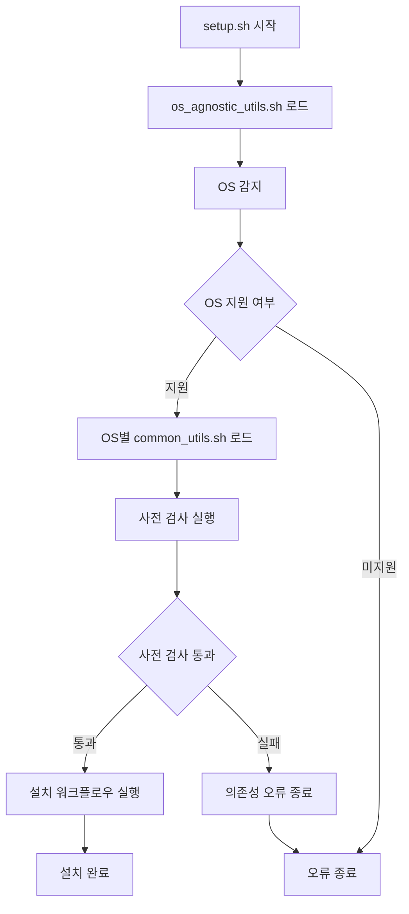

### 1.2 설치 단계별 흐름

| 단계 | 스크립트 | 실행 순서 | 실패 시 동작 |
|------|----------|-----------|-------------|
| 1 | `install_clang.sh` | 컴파일러 우선 설치 | 전체 프로세스 중단 |
| 2 | `install_cmake.sh` | 빌드 시스템 설치 | 전체 프로세스 중단 |
| 3 | `install_ninja.sh` | 빌드 도구 설치 | 전체 프로세스 중단 |
| 4 | `install_git.sh` | 버전 관리 설치 | 전체 프로세스 중단 |
| 5 | `install_github_cli.sh` | GitHub CLI 설치 | 전체 프로세스 중단 |
| 6 | `install_coding_font.sh` | 폰트 설치 | 전체 프로세스 중단 |
| 7 | `install_vscode.sh` | 편집기 설치 | 전체 프로세스 중단 |
| 8 | `configure_vscode.sh` | VS Code 설정 | 전체 프로세스 중단 |
| 9 | `setup_sample_project.sh` | 샘플 프로젝트 생성 | 전체 프로세스 중단 |

## 2. OS별 설치 플로우

### 2.1 macOS 설치 플로우

#### 사전 검사

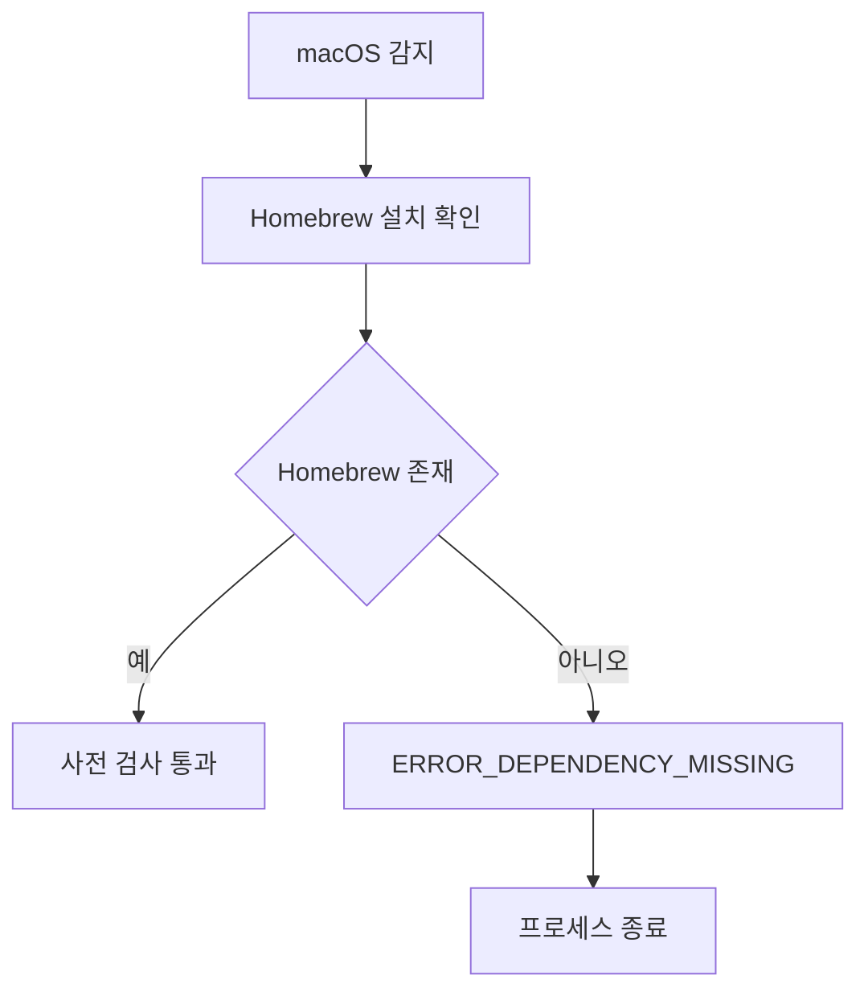

#### 개별 도구 설치 패턴

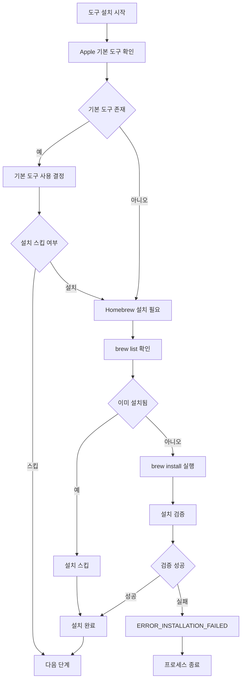

### 2.2 Linux 설치 플로우

#### 사전 검사

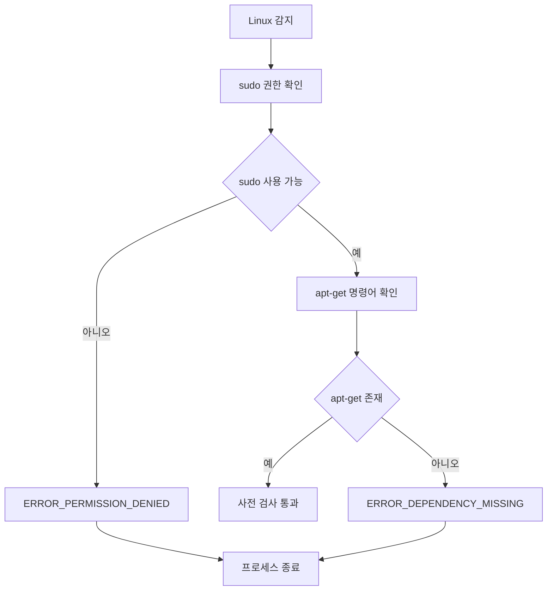

#### 개별 도구 설치 패턴

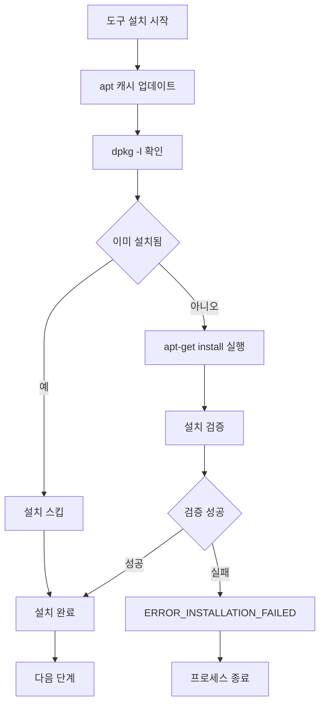

## 3. 개별 도구 설치 세부 플로우

### 3.1 Clang/LLVM 설치 플로우

#### macOS Clang 설치

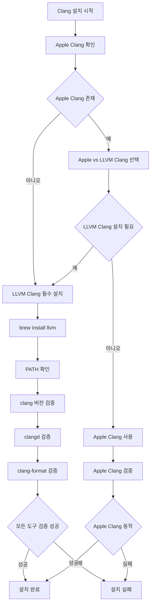

#### Linux Clang 설치

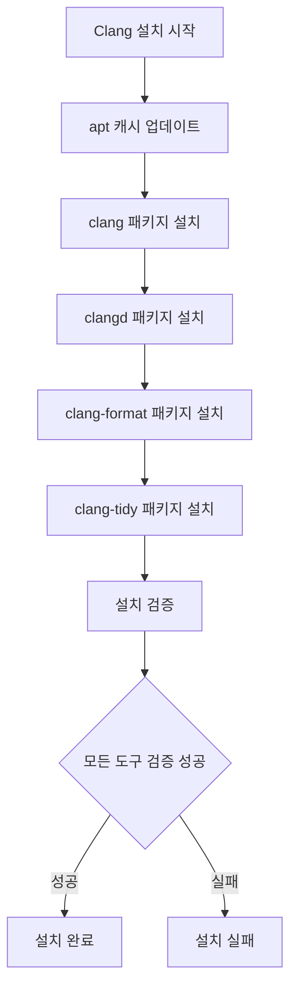

### 3.2 VS Code 설정 플로우

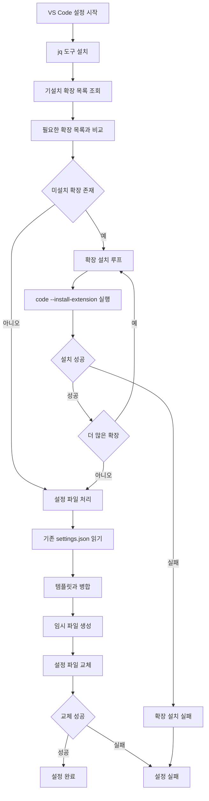

### 3.3 샘플 프로젝트 생성 플로우

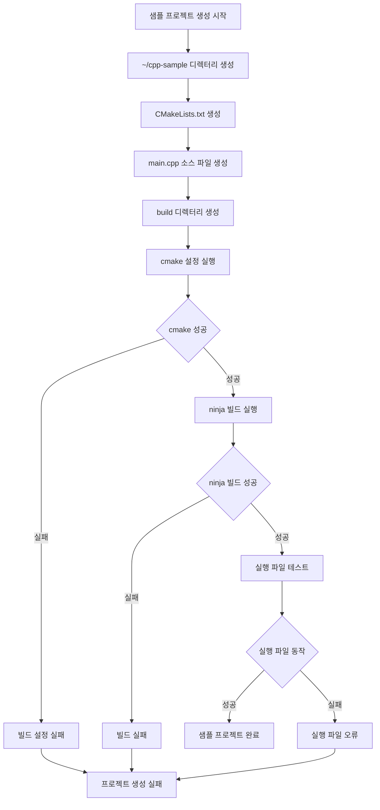

## 4. 오류 처리 플로우

### 4.1 표준 오류 처리

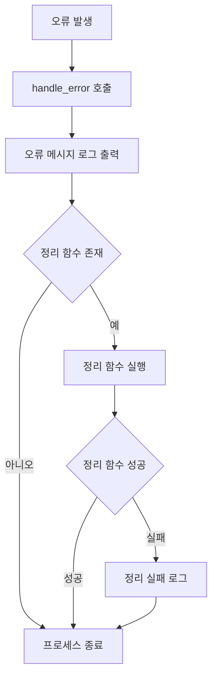

### 4.2 중요 명령어 실행 플로우

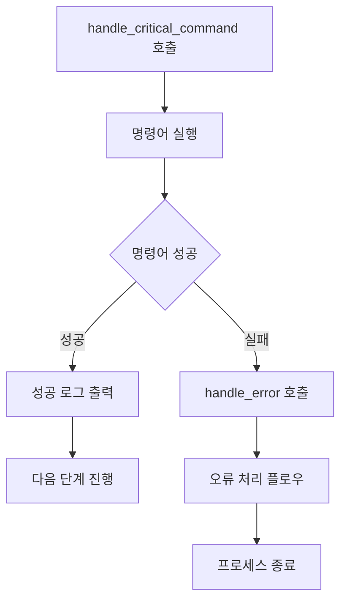

## 5. 검증 플로우 (verify.sh)

### 5.1 전체 검증 플로우

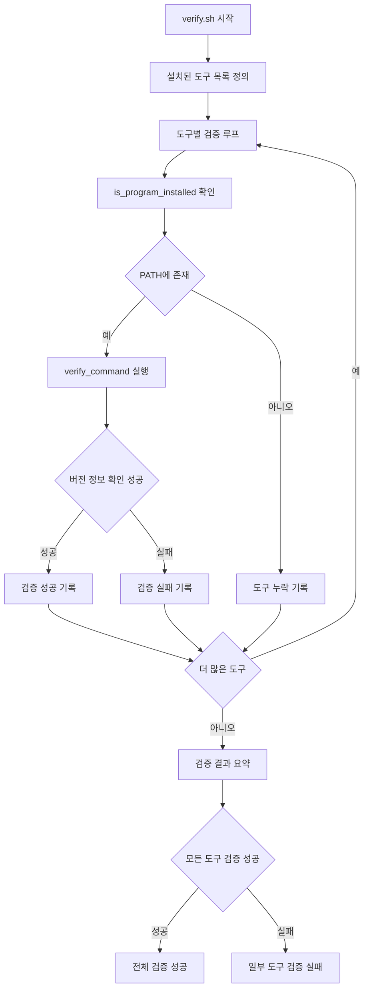

### 5.2 개별 도구 검증 세부사항

| 도구 | 검증 명령어 | 성공 조건 | 실패 시 메시지 |
|------|------------|----------|---------------|
| clang | `clang --version` | 버전 정보 출력 | "Clang compiler not found or not working" |
| clangd | `clangd --version` | 버전 정보 출력 | "clangd language server not found" |
| clang-tidy | `clang-tidy --version` | 버전 정보 출력 | "clang-tidy static analyzer not found" |
| clang-format | `clang-format --version` | 버전 정보 출력 | "clang-format code formatter not found" |
| lldb | `lldb --version` | 버전 정보 출력 | "LLDB debugger not found" |
| cmake | `cmake --version` | 버전 3.16+ | "CMake not found or version too old" |
| ninja | `ninja --version` | 버전 정보 출력 | "Ninja build tool not found" |
| git | `git --version` | 버전 정보 출력 | "Git version control not found" |
| gh | `gh --version` | 버전 정보 출력 | "GitHub CLI not found" |

## 서브브랜치 네비게이션

- [01-overview.md](01-overview.md) - 프로젝트 전체 개요
- [02-structure.md](02-structure.md) - 프로젝트 구조 상세 분석
- [03-components.md](03-components.md) - 구성 요소별 상세 설명
- [05-verification.md](05-verification.md) - 검증 시스템 상세 설명
- [06-specifications.md](06-specifications.md) - 기술 사양 및 요구사항
- [index.md](index.md) - 서브브랜치 인덱스